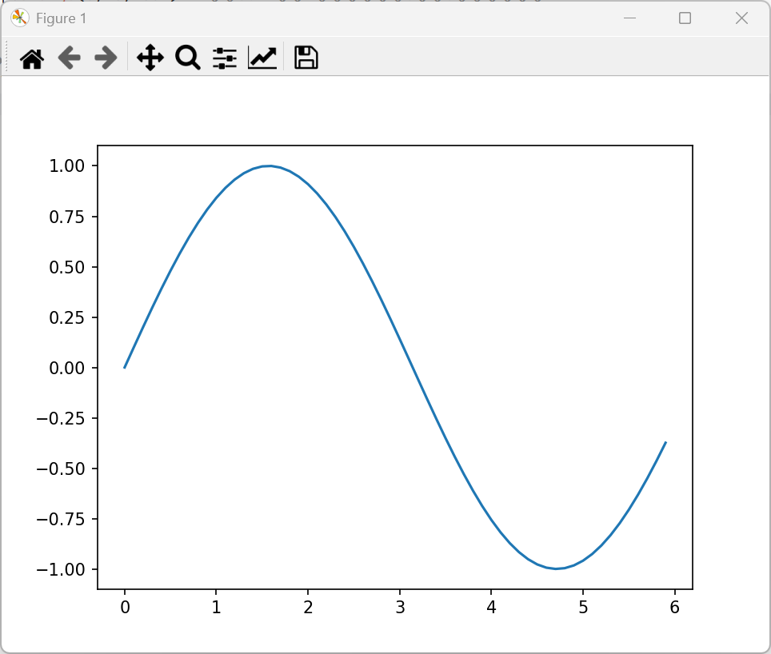
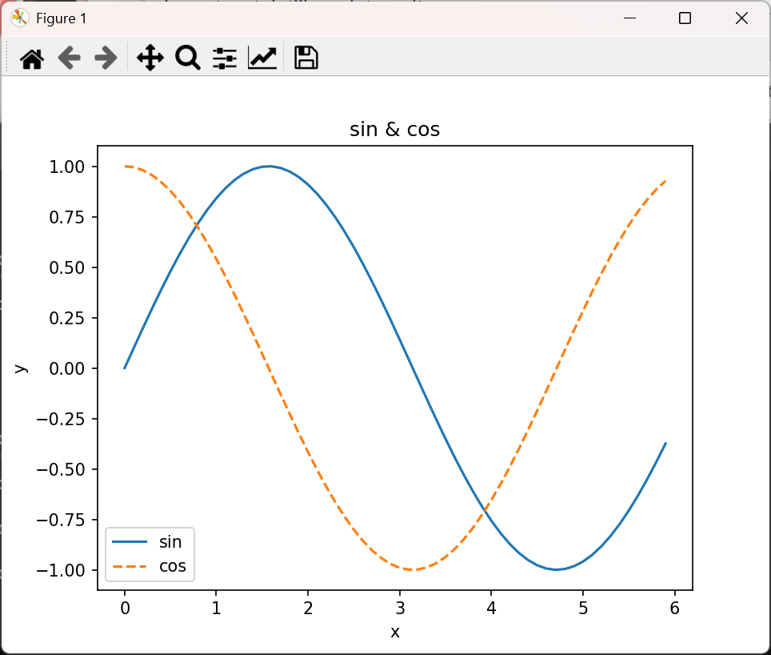

sin.py

```python
# -*- coding: utf-8 -*-

import numpy as np
import matplotlib.pyplot as plt

# 生成数据
x = np.arange(0, 6, 0.1) # 以0.1为单位，生成0到6的数据
y = np.sin(x)

# 绘制图形
plt.plot(x,y)
plt.show()

```




cos.py

```python

import numpy as np
import matplotlib.pyplot as plt

# 生成数据
x = np.arange(0, 6, 0.1) # 以0.1为单位，生成0到6的数据
y1 = np.sin(x)
y2 = np.cos(x)

# 绘制图形
plt.plot(x, y1, label="sin")
plt.plot(x, y2, linestyle = "--", label="cos") # 用虚线绘制
plt.xlabel("x") # x轴标签
plt.ylabel("y") # y轴标签
plt.title('sin & cos') # 标题
plt.legend()
plt.show()

```




show.py

```python

import matplotlib.pyplot as plt
from matplotlib.image import imread

img = imread('ruike.png')  # 读取图像
plt.imshow(img)
plt.show()

```


